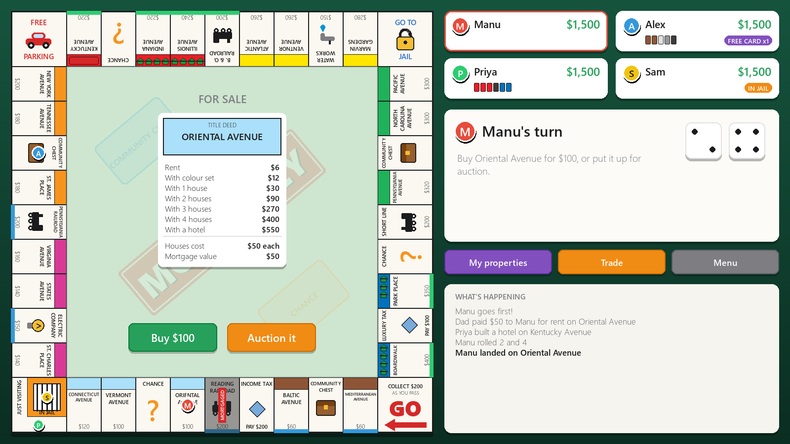

# Monopoly

A complete Monopoly game made with Python and pygame: every rule, 2 to 6 players on one computer. Manu is building it one quest at a time, and it's how he's learning to make a real project out of lots of files that work together.



**Start here → [quests/README.md](quests/README.md)**

## Run it

```text
pip install -r requirements.txt     (only the first time)
python main.py                      play the game
python -m pytest                    run the tests
```

## What goes where

This is the finished project. The quests build it one piece at a time.

```text
main.py              starts the game (3 lines!)
data/                facts: the 40 spaces and the cards, written as JSON
logic/               the RULES. No drawing at all.
    player.py            one player: name, cash, position...
    board.py             the 40 spaces
    game.py              turns, moving, buying, jail, cards, debt  (the big one)
    rent.py              how much rent costs
    auction.py           bidding for a property
    cards.py             Chance and Community Chest piles
    buildings.py         houses, hotels, mortgages
    trade.py             swapping stuff between players
    save.py              saving and loading a game
ui/                  everything you SEE. pygame lives here.
    app.py               the window and the game loop
    theme.py             colours and fonts
    draw.py              small drawing helpers (text, shadows, tokens)
    widgets.py           Button and TextBox
    screens.py           menu, setup, rules, winner
    play_screen.py       the main game screen, which holds the pieces below
    board_layout.py      where each space goes (just maths)
    board_art.py         paints the board picture once
    board_view.py        draws owners, houses and tokens on top, every frame
    sidebar.py           players, dice, buttons, log
    stage.py             the middle of the board: deeds, cards, auctions
    card_art.py          title deeds and Chance cards
    popups.py            pause menu and "are you sure?" boxes
    assets_popup.py      the "My properties" box
    trade_popup.py       the trade box
tests/               checks that the rules work, run by pytest
assets/              your pictures
sandbox/             practice code (not part of the game)
quests/              the lessons
```

## The one big idea

```text
   ui/  ──reads──►  logic/  ──reads──►  data/
 (draws it)        (the rules)         (the facts)
```

`logic/` never imports pygame. It doesn't know the screen exists. That's why the rules can be tested in half a second without opening a window, and why `ui/` can be redrawn to look totally different without breaking a single rule.
